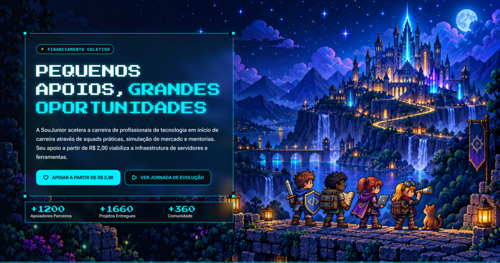

# DevLevelUp

LP (estética 16bits — dark arcade) feita para o Hackathon SouJunior.
Campanha de apoio ao projeto via [Apoia.se](https://apoia.se/soujunior).

## Stack

- **React** 19.3.0
- **React DOM** 19.3.0
- **Vite** 8.3.0
- **TypeScript** 6.0.3
- **Tailwind CSS** 4.3.3 (`@tailwindcss/vite` 4.3.3)
- **Framer Motion** 13.2.0
- **Lucide React** 1.45.0
- **clsx** 2.1.1
- **tailwind-merge** 3.7.0
- **@fontsource/\*** 5.3.0 (Plus Jakarta Sans, Press Start 2P, Roboto Flex, Sora)

### Ferramentas de desenvolvimento

- **ESLint** 10.10.0
- **Prettier** 3.9.6
- **Husky** 9.1.7
- **lint-staged** 17.5.1
- **typescript-eslint** 8.70.0

## Squad

| Papel | Nome | LinkedIn | GitHub |
| --- | --- | --- | --- |
| PO (mentor) | Ricardo Tarchetti | [ricardotarchetti](https://www.linkedin.com/in/ricardotarchetti) | — |
| PO / QA | Sam Henrique | [samlimongihenrique](https://www.linkedin.com/in/samlimongihenrique) | — |
| Design | Claudia Mello | [claudia-ferreira-de-mello](https://www.linkedin.com/in/claudia-ferreira-de-mello) | — |
| Design | Renan Oliveira | [renan-oliveira-124564156](https://www.linkedin.com/in/renan-oliveira-124564156) | — |
| Dev (mentor) | Emerson Oliveira Leite Silva | [emersonoliveiratech](https://www.linkedin.com/in/emersonoliveiratech) | — |
| Dev | Anderson Guassu | [anderson-amelio-de-andrade-guassu-37a933201](https://www.linkedin.com/in/anderson-amelio-de-andrade-guassu-37a933201/) | [ANDERSONGUASSU](https://github.com/ANDERSONGUASSU) |
| Dev | Danielle Braga | [daniellebbraga](https://www.linkedin.com/in/daniellebbraga) | [daniebraga](https://github.com/daniebraga) |
| Dev | Pedro Jaime | [pedro-jaime-carvalho-maia](https://www.linkedin.com/in/pedro-jaime-carvalho-maia/) | — |
| QA | Felipe Siqueira | [felipe-rodrigues-siqueira-00694a369](https://www.linkedin.com/in/felipe-rodrigues-siqueira-00694a369) | [Fesqueira](https://github.com/Fesqueira) |
| QA | Italo Costa Ribeiro | [ítalo-costa-b9b7a12ab](https://www.linkedin.com/in/%C3%ADtalo-costa-b9b7a12ab/) | — |

## Design (Figma)

Protótipo da LP no Figma — [abrir no Figma](https://www.figma.com/design/C4zasm3lRXrvMw1NmvV8uP/Hackathon-SouJunior---Landing-Page-Apoia-se?node-id=75-75&t=Oznc1tXCsTwg5JJw-1)

Print da tela principal (Hero — protótipo hi-fi):



## Rodando

```bash
npm install
npm run dev
```

## Comandos

```bash
npm run dev      # dev server
npm run build    # typecheck + build
npm run lint     # eslint
npm run format   # prettier --write
npm run format:check  # prettier --check
npm run preview  # serve build
```